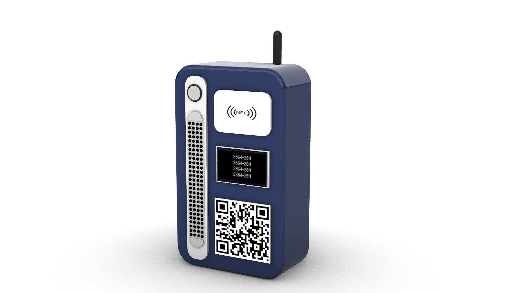

# Spectra-Trust: Verified Edge-AI Retail Terminal 

**Spectra-Trust** is a ruggedized smart payment terminal designed to bridge the credit gap for unbanked micro-merchants. By combining **ESP32-S3 Edge-AI** with biometric **liveness detection**, it transforms noisy cash transactions into a verified "Digital Khata" for formal credit scoring.

## Key Features

* **Biometric Liveness Verification:** Prevents payment fraud using **Edge-AI blink detection** to ensure the physical presence of the payer.
* **High-Fidelity Audio & UI:** Delivers instant transaction clarity via **I2S regional voice alerts** and a clear **2.8" TFT visual interface**.
* **Automated Digital Khata:** Replaces manual record-keeping by instantly logging every verified sale into a secure, **hardware-signed digital ledger**.
* **Verified Credit Scoring:** Generates "Truth Data" reports that allow unbanked merchants to prove cash-flow history for **formal bank micro-loans**.

### Hardware Stack (Simulated)
* **Controller:** ESP32-S3 (Dual-core, AI-accelerated)
* **Display:** ILI9341 2.8" TFT LCD (SPI Interface)
* **Audio:** MAX98357A I2S DAC + 8Ω Speaker (Regional Voice Alerts)
* **Security:** PN532 NFC Module + HC-SR04 for proximity sensing.

### Software Stack
* **Firmware:** C++/Arduino (Optimized for ESP-IDF)
* **Vision Engine:** Python + OpenCV + MediaPipe (Liveness Detection)
* **Communication:** Serial-over-Websocket bridge for real-time Hardware-in-the-Loop (HIL) simulation.

## Impact Goals
1.  **Reduce Default Risk:** Hardware-signed transactions provide banks with high-confidence data.
2.  **Financial Inclusion:** Moving 10M+ Kirana stores from paper ledgers to digital credit identities.
3.  **Low-Cost Deployment:** Designed for sub-$15 manufacturing using edge computing instead of expensive cloud processing.
